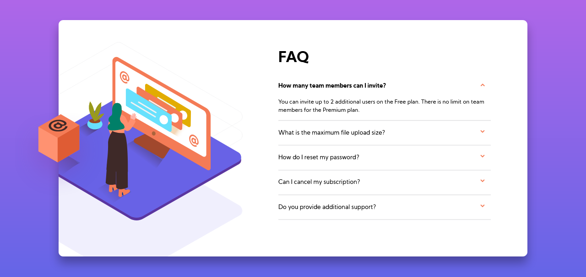

# Frontend Mentor - FAQ accordion card solution

This is a solution to the [FAQ accordion card challenge on Frontend Mentor](https://www.frontendmentor.io/challenges/faq-accordion-card-XlyjD0Oam). Frontend Mentor challenges help you improve your coding skills by building realistic projects. 

## Table of contents

- [Overview](#overview)
  - [The challenge](#the-challenge)
  - [Screenshot](#screenshot)
  - [Links](#links)
- [My process](#my-process)
  - [Built with](#built-with)
  - [What I learned](#what-i-learned)
  - [Continued development](#continued-development)
- [Author](#author)

## Overview

### The challenge

Users should be able to:

- View the optimal layout for the component depending on their device's screen size
- See hover states for all interactive elements on the page
- Hide/Show the answer to a question when the question is clicked

### Screenshot

### Links

- Solution URL: [https://github.com/DineshrajAnandan/FrontEndMentorChallenges/tree/main/faq-accordion-card](https://github.com/DineshrajAnandan/FrontEndMentorChallenges/tree/main/faq-accordion-card)
- Live Site URL: [https://dineshrajanandan.github.io/FrontEndMentorChallenges/faq-accordion-card/index.html](https://dineshrajanandan.github.io/FrontEndMentorChallenges/faq-accordion-card/index.html)

## My process

### Built with

- Semantic HTML5 markup
- CSS custom properties
- Flexbox
- CSS Animation
- JavaScript

### What I learned

I learned about using gradient in css and some CSS transitions.

### Continued development

Learn more about CSS transitions and animations.

## Author

- Frontend Mentor - [@DineshrajAnandan](https://www.frontendmentor.io/profile/DineshrajAnandan)
- Twitter - [@Dineshraj_A](https://www.twitter.com/Dineshraj_A)
