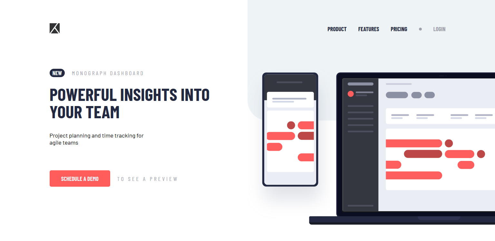

# Frontend Mentor - Project tracking intro component solution

This is a solution to the [Project tracking intro component challenge on Frontend Mentor](https://www.frontendmentor.io/challenges/project-tracking-intro-component-5d289097500fcb331a67d80e). Frontend Mentor challenges help you improve your coding skills by building realistic projects. 

## Table of contents

- [Overview](#overview)
  - [The challenge](#the-challenge)
  - [Screenshot](#screenshot)
  - [Links](#links)
- [My process](#my-process)
  - [Built with](#built-with)
  - [What I learned](#what-i-learned)
  - [Useful resources](#useful-resources)
- [Author](#author)

## Overview

### The challenge

Users should be able to:

- View the optimal layout for the site depending on their device's screen size
- See hover states for all interactive elements on the page
- Create the background shape using code

### Screenshot



### Links

- Solution URL: [https://github.com/DineshrajAnandan/FrontEndMentorChallenges/tree/main/junior/project-tracking-intro-component](https://github.com/DineshrajAnandan/FrontEndMentorChallenges/tree/main/junior/project-tracking-intro-component)
- Live Site URL: [https://dineshrajanandan.github.io/FrontEndMentorChallenges/junior/project-tracking-intro-component/index.html](https://dineshrajanandan.github.io/FrontEndMentorChallenges/junior/project-tracking-intro-component/index.html)

## My process

### Built with

- Semantic HTML5 markup
- CSS custom properties
- Flexbox
- JavaScript

### What I learned

Drawing images with CSS gradients.

```css
 background: radial-gradient(
      7em 7em at calc(50% + 3.5em) calc(50% - 3.5em),
      var(--cl-light-grayish-blue) 50%,
      transparent 50%
    ),
    linear-gradient(var(--cl-light-grayish-blue), var(--cl-light-grayish-blue))
      100% 0% / 50% calc(50% - 3.5em),
    linear-gradient(var(--cl-light-grayish-blue), var(--cl-light-grayish-blue))
      100% calc(50% - 3.5em) / calc(50% - 3.5em) 7em;
```

### Useful resources

- [https://css-tricks.com/drawing-images-with-css-gradients/](https://css-tricks.com/drawing-images-with-css-gradients/) - This helped me to learn drawing images using CSS gradients.

## Author

- Frontend Mentor - [@DineshrajAnandan](https://www.frontendmentor.io/profile/DineshrajAnandan)
- Twitter - [@Dineshraj_A](https://www.twitter.com/Dineshraj_A)
