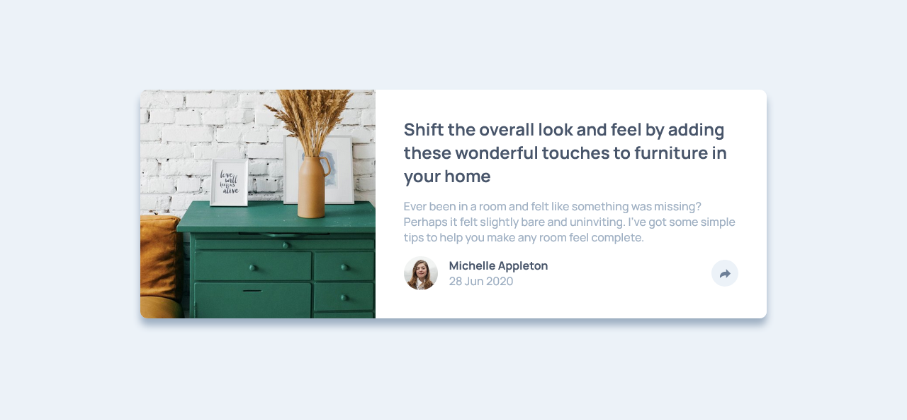

# Frontend Mentor - Article preview component solution

This is a solution to the [Article preview component challenge on Frontend Mentor](https://www.frontendmentor.io/challenges/article-preview-component-dYBN_pYFT). Frontend Mentor challenges help you improve your coding skills by building realistic projects. 

## Table of contents

- [Overview](#overview)
  - [The challenge](#the-challenge)
  - [Screenshot](#screenshot)
  - [Links](#links)
- [My process](#my-process)
  - [Built with](#built-with)
  - [What I learned](#what-i-learned)
  - [Continued development](#continued-development)
  - [Useful resources](#useful-resources)
- [Author](#author)

## Overview

### The challenge

Users should be able to:

- View the optimal layout for the component depending on their device's screen size
- See the social media share links when they click the share icon

### Screenshot

### Links

- Solution URL: [https://github.com/DineshrajAnandan/FrontEndMentorChallenges/tree/main/newbie/article-preview-component](https://github.com/DineshrajAnandan/FrontEndMentorChallenges/tree/main/newbie/article-preview-component)
- Live Site URL: [https://dineshrajanandan.github.io/FrontEndMentorChallenges/newbie/article-preview-component/index.html](https://dineshrajanandan.github.io/FrontEndMentorChallenges/newbie/article-preview-component/index.html)

## My process

### Built with

- Semantic HTML5 markup
- CSS custom properties
- Flexbox

### What I learned

I have learned to create custom CSS tooltips using css positioning.

### Continued development

Understand well on CSS positioning.

### Useful resources

- [https://www.w3schools.com/css/css_tooltip.asp](https://www.w3schools.com/css/css_tooltip.asp) - This helped me to create custom CSS tooltip.

## Author

- Frontend Mentor - [@DineshrajAnandan](https://www.frontendmentor.io/profile/DineshrajAnandan)
- Twitter - [@Dineshraj_A](https://www.twitter.com/Dineshraj_A)
